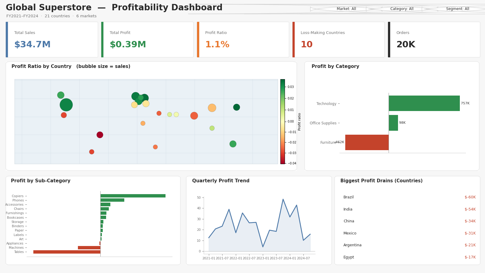

# Global Superstore Profitability Dashboard (Tableau)

An interactive Tableau dashboard I built to find where a global retailer actually makes and
loses money, with a world profit map and category-level drill-down.

Stack: Tableau, calculated fields

**Live dashboard →** https://public.tableau.com/app/profile/kenechukwu.ven.anyanwuocha/viz/GlobalSuperstoreProfitability_17840574172740/GlobalSuperstoreProfitability



## What it does
The company looks fine on sales but is barely profitable, so this dashboard answers the real
question: which countries, categories, and sub-categories are dragging profit down. It covers
20,000 orders across 21 countries and 6 markets from 2021 to 2024.

## The data
`data/global_superstore.csv` is a single tidy orders table (the shape Tableau likes), with
geography Tableau auto-geocodes plus category, segment, sales, discount, and profit:

Country, ISO3, Market, Segment, Category, SubCategory, OrderDate, Quantity, Discount, Sales, Profit

It is synthetic and reproducible (`generate_data.py`, fixed seed).

## What the numbers show
- $34.7M in sales but only **$0.39M profit**, a razor-thin **1.1% profit ratio**
- **10 of 21 countries lose money**; the biggest drains are Brazil, India, China, and Mexico
- **Furniture loses money overall (-3.8%)**, dragged down by the **Tables sub-category at -$663K**
- **Technology is the engine** of the business at a +4.0% profit ratio (+$757K)
- The story is discount-driven: heavy discounting in emerging markets and on furniture wipes out margin

## The takeaway
Sales growth is hiding a margin problem. Cutting discounts on Tables and in the loss-making
markets, and leaning into Technology, is where the profit recovery is.

## Calculated fields
See `calculated_fields.txt` for the full set: Profit Ratio, AOV, Profit per Order, Loss Flag,
a KPI traffic-light, YoY table calcs, and discount bands.

## Files
- `dashboard_mockup.png` — the dashboard
- `calculated_fields.txt` — every calculated field in the workbook
- `generate_data.py` — rebuilds the dataset
- `data/global_superstore.csv` — the source extract
- `SETUP.md` — how the sheets and dashboard are wired, and how it publishes to Tableau Public

## Rebuild the dataset
```bash
pip install -r requirements.txt
python generate_data.py
```

## Live version
Built in Tableau Public and published to the web — see the link at the top of this repo.
